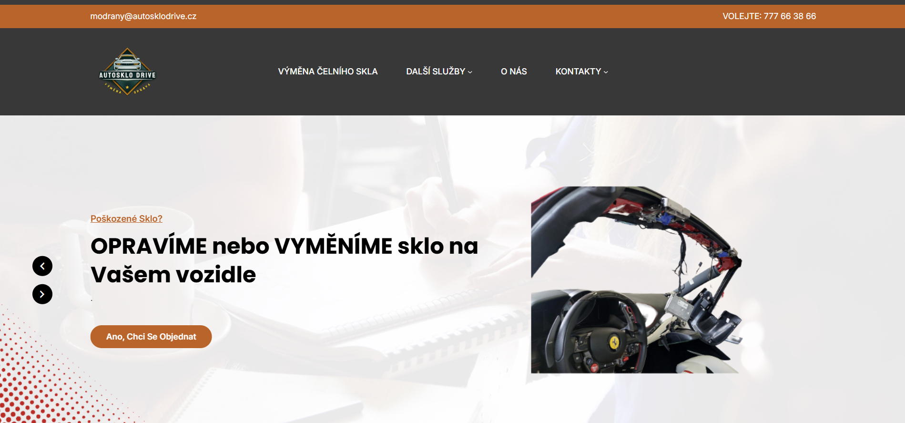
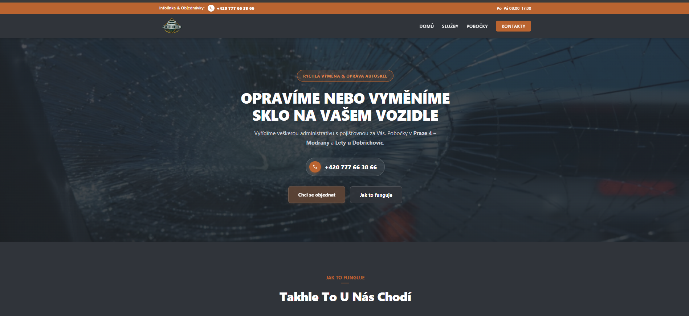

# Autosklo Drive — Modern Website Redesign

Modern, responsive web application redesign for an auto glass repair & replacement service in Prague (*Autosklo Drive*).

## 🚀 Live Demo & Original
* **Live Demo (Redesign):** [KrychVas.github.io/autosklo-drive-redesign](https://KrychVas.github.io/autosklo-drive-redesign/)
* **Original Site:** [autosklodrive.cz](https://autosklodrive.cz)

---

## 📸 Before vs After

| Original Design | New Redesign |
| :---: | :---: |
|  |  |

---

## ✨ Key Improvements Made
* **Modern UI/UX:** Dark thematic visual style tailored for automotive service with clear call-to-actions.
* **Header & Quick Contact:** Clean top bar featuring working hours, quick dial button, and streamlined navigation menu.
* **Interactive Booking Form:** Form with validation for Czech phone numbers, honeypot anti-spam protection, and EmailJS/Formspree integration.
* **Responsive Layout:** Optimized pixel-perfect performance across mobile, tablet, and desktop devices.

---

## 🛠 Tech Stack
* **Build Tool:** Vite
* **Frontend:** JavaScript (ES6+ Modules), HTML5, CSS3
* **Form Handler:** EmailJS / Formspree API